<!-- TOC -->
  * [逼逼赖赖：](#逼逼赖赖)
  * [我的软件要长什么样？我要做成什么样？](#我的软件要长什么样我要做成什么样)
  * [开始！](#开始)
  * [结束！](#结束)
  * [好了好了，不开玩笑了，现在就以SynClipboard为例开始我们的开发之旅吧！](#好了好了不开玩笑了现在就以synclipboard为例开始我们的开发之旅吧)
    * [看看SynClipboard的主界面，是不是很漂亮？所以接下来A2带着您一起开发一个漂亮的主界面！](#看看synclipboard的主界面是不是很漂亮所以接下来a2带着您一起开发一个漂亮的主界面)
    * [首先是分析](#首先是分析)
  * [开始编程！](#开始编程)
    * [1. 创建一个JavaFX项目](#1-创建一个javafx项目)
    * [2. 修改标题栏](#2-修改标题栏)
  * [很好，您现在已经拥有了一个漂亮的标题栏了！休息一下我们A3再见！o(*^▽^*)┛](#很好您现在已经拥有了一个漂亮的标题栏了休息一下我们a3再见o)
<!-- TOC -->

## 逼逼赖赖：
**俗话说万事开头难，所以在A2我们将面临Javafx软件开发中最最难的一部分。打起精神！**

## 我的软件要长什么样？我要做成什么样？
请思考一下这个Javafx软件开发中最难的问题，没错这就是最难的问题！
画好靶子怎么射只要射上去就可以了，但要是没靶子，_你怎么射_？

## 开始！

为了解决这个问题，我们可以尝试一下这样做：
1. 打开浏览器
2. 搜索剪切板同步软件
3. 找到并下载
4. 打开
5. 看看人家的界面怎么做的
6. 照着做
7. 加点自己的料
8. 打上自己的戳
9. 打包
10. 发行
11. 芜湖起立！为自己喝彩！

## 结束！

**恭喜你，你成功开发了一个JavaFX软件！**

## 好了好了，不开玩笑了，现在就以SynClipboard为例开始我们的开发之旅吧！

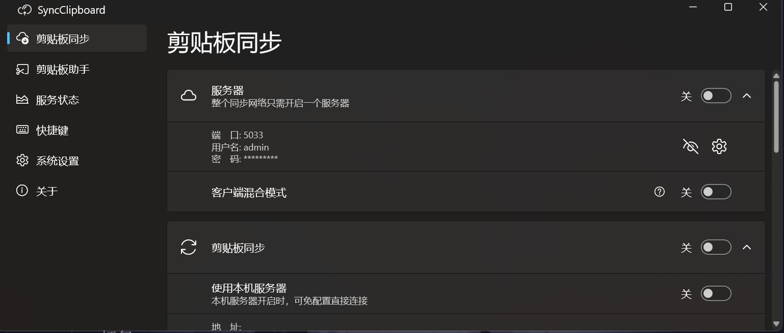

### 看看SynClipboard的主界面，是不是很漂亮？所以接下来A2带着您一起开发一个漂亮的主界面！
### 首先是分析

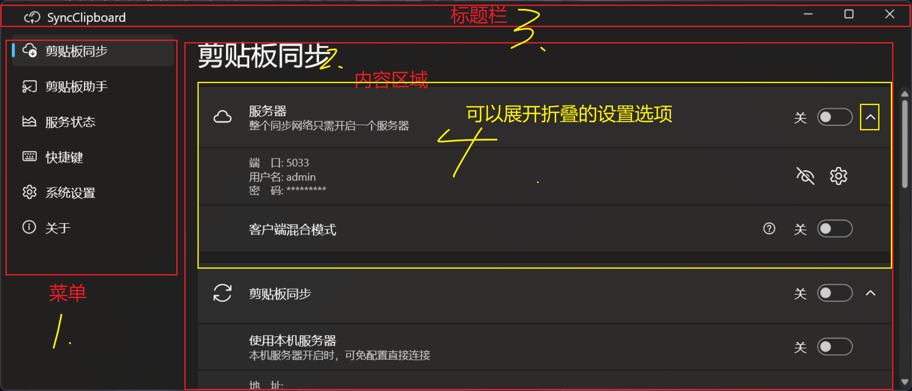

一共四部分，分别是标题栏，菜单栏，内容区域，可折叠菜单选项，只有四部分。一点也不复杂不是吗¯\_(ツ)_/¯？
##  开始编程！
###  1. 创建一个JavaFX项目
1. 打开您的ide，选择新建Javafx项目
2. 填写项目名称为SynClipboard_JFX
3. 选择maven 以及您的GraalVM（17 Gluon构建版本）
4. 创建git仓库选项建议您选上
5. 填写其它信息，然后点击完成
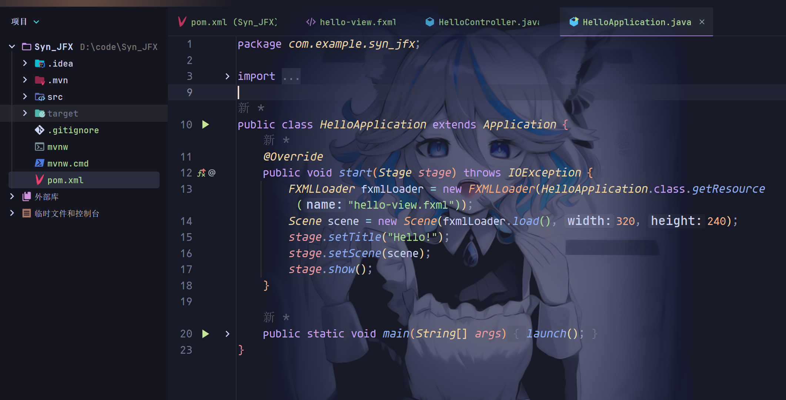
6. 完成创建后大抵这个样子（本教程使用IDEA，忽略背景图）
7. 点一下运行，这一步的目的是补全maven依赖，请耐心等待，我建议您在执行这一步前设置好maven镜像源或代理保证网络畅通，以避免出现等得人都谢了。
8. 如果一起没有问题您将看到如下界面
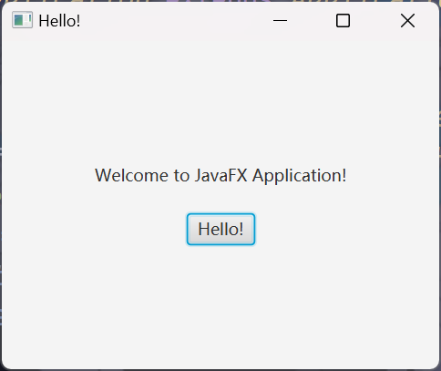
### 2. 修改标题栏
1. 改个标题
   1. 我猜英语LV6的您一定注意到了
   2. 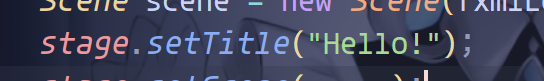
   3. 瞧瞧多么直白的方法名！
   4. 接下来让我们起个好看的标题名吧！
   5. 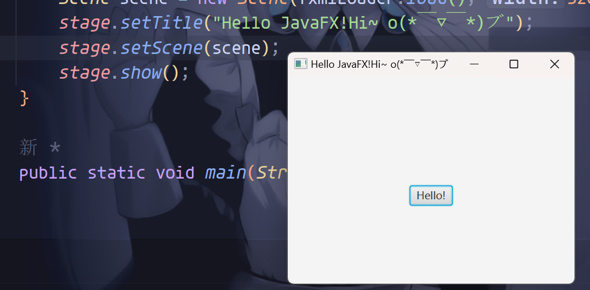
   6. 是不是很棒！
2. 改个图标
   1. 嗯嗯，这个图标要怎么改呢？
   2. 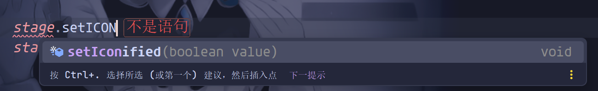
   3. 没有setIcon方法？那我们要怎么改？
   4. 这时候我们就要用到万能的Google了！
   5. 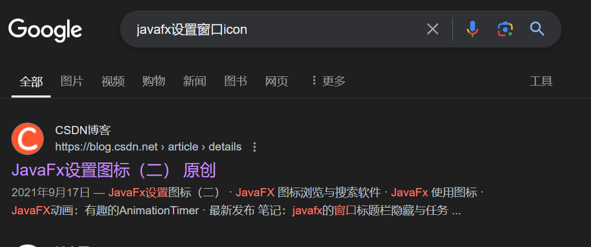
   6. 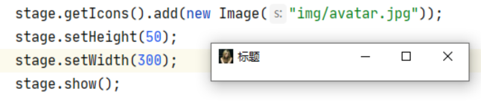
   7. 原来如此！
   8. 让我们设置一个好看的图标吧！
   9. 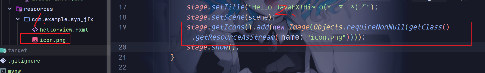
   10. 首先把图标丢进resource文件然
   11. 然后我们就可以在代码中使用了！
   12. 运行：
   13. 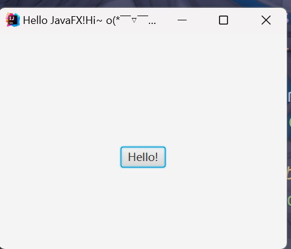
   14. 是不是很棒很棒很棒！
## 很好，您现在已经拥有了一个漂亮的标题栏了！休息一下我们A3再见！o(*^▽^*)┛