# JavaFx从入门到入土A3

## 实话实说：
本来A3是想完成菜单和右侧内容切换的，但是吧我突然发现我不会...
所以呢，A3就比较的简陋了，甚至逻辑混乱。

## 谷歌（还不会）
遇到不会的怎么办？
谷歌（大声！）
1. 谷歌：javafx 主页面切换
2. 
3. 一个一个看，看到这个和咱的问题相关
4. 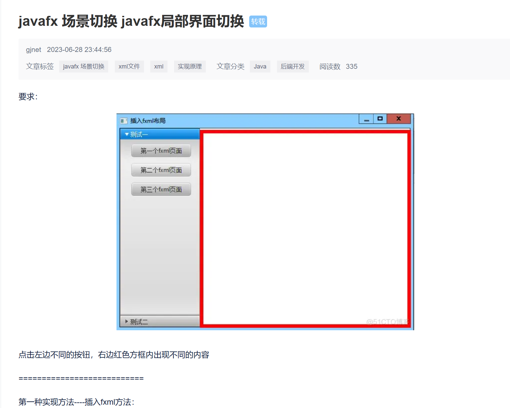
5. 仔细一读只有一句有用的
6. 
7. 害！这怎么整
8. 唉？！ai！咋把这个好兄弟忘了
9. 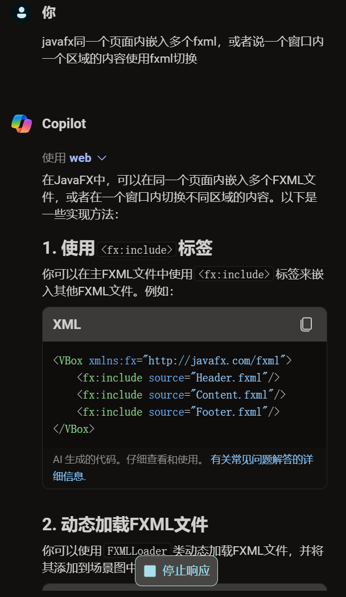
10. 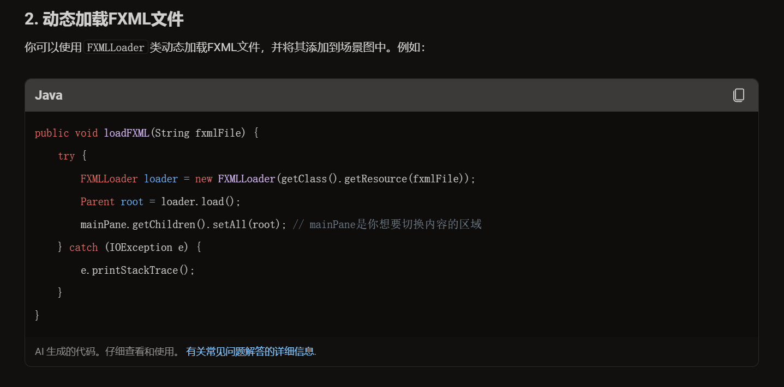
11. 哦吼！原来如此！ 
> javafx是节点树那种的，所有内容都是一个一个的node（节点）
> 具体看这里： [javafx体系结构](https://docs.oracle.com/javase/8/javafx/get-started-tutorial/jfx-architecture.htm#CHDFDAFF) 
## 写代码（会了）
1. 在sceneBuilder里修改main.fxml，改的和图里一样
2. 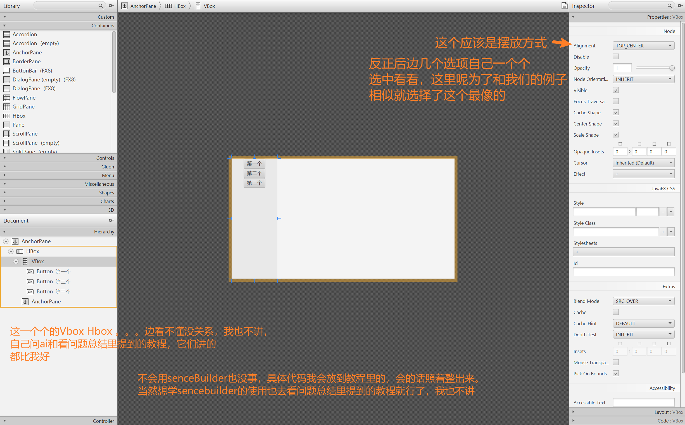
3. 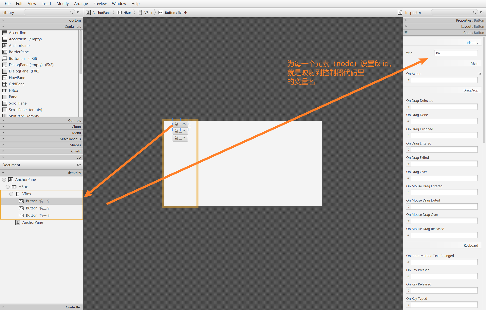
4. 为按钮添加事件监听，有两种办法
   1. 在控制器类的初始化方法里添加
    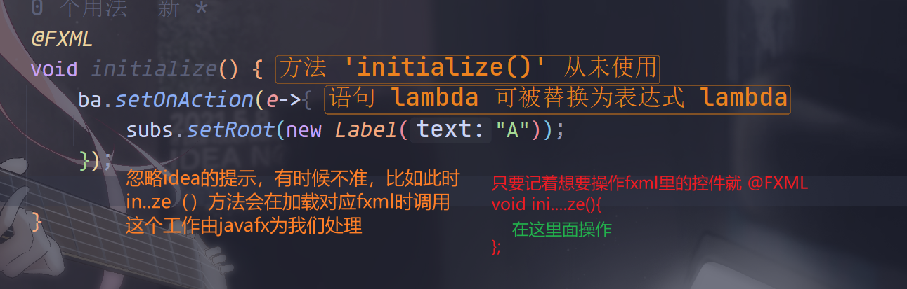
   2. 在fxml文件中指定（这里使用senceBuilder）
   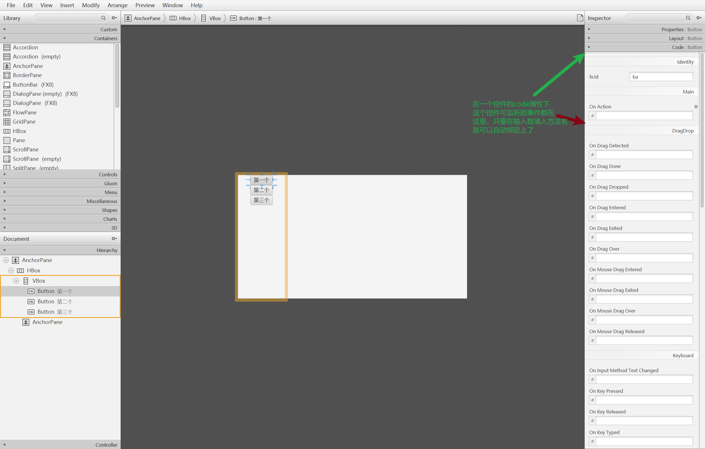
      1. 这里我们只用到按键的被单击事件（On mouse Clicked），在输入框填入方法名
      
      2. 然后点击菜单栏的View>Show sample ...
      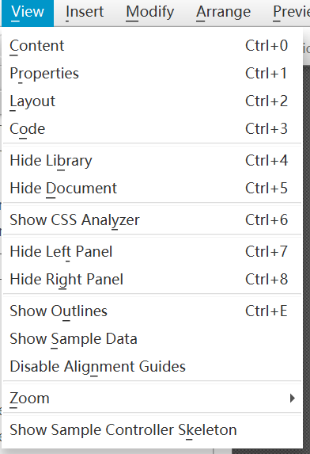
      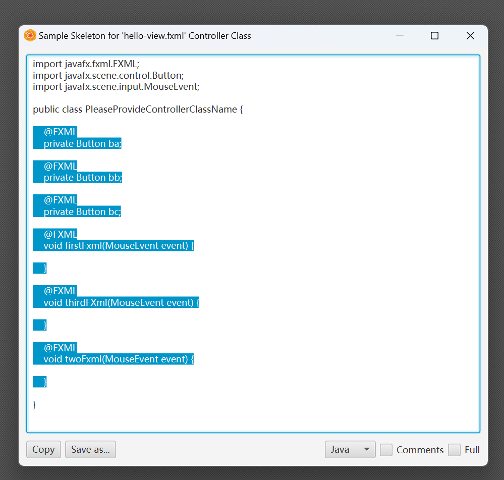
      3. 复制软件给的示例代码粘贴到我们的控制器类中
      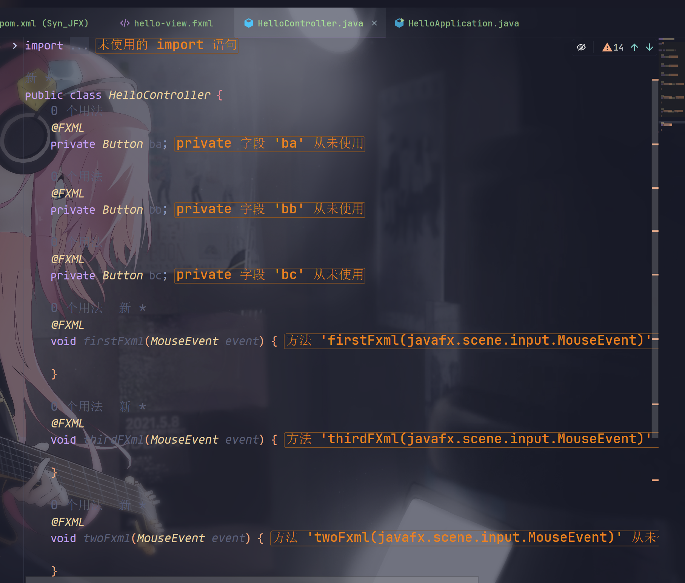
5. 创建多个fxml文件，分别对应不同的页面（这里我添加了一个文本用来区分每个fxml）
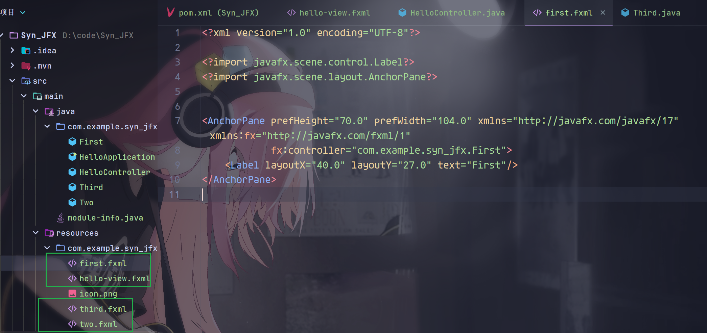
6. 在控制器中实现切换逻辑
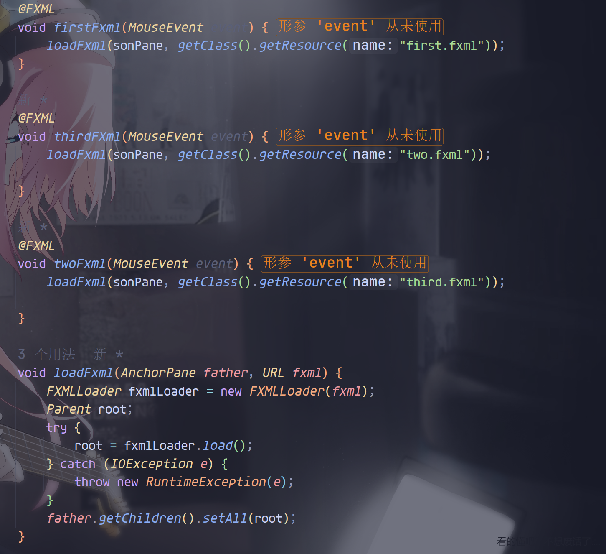
7. 启动!

   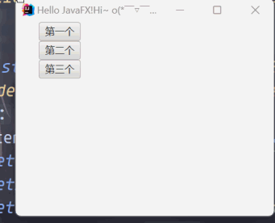
## 大功告成！！！A4再见！

### [代码仓库](https://github.com/iammmmmmm/Syn_JFX)