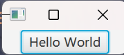

# 抽象（abstract）：
带领您迈出在Javafx领域的第一步！
## 入门：
### 安装javafx环境：
安装jdk 8（以后简称j8），自行解决本教程就不浪费字符了。

### Hello world：
1. 打开你的ide（本教程使用的是idea）
2. 新建项目
3. 设置好项目路径，记得选j8，使用maven作为构建系统
4. 在src/main/java下新建类Helloworld
5. 复制下面的代码到新建的类里然后执行（不用研究每一行是干啥的只要不报错能运行就行）：
```java
public class helloWorld extends Application {

    public static void main(String[] args) {
        launch(args);
    }
    @Override
    public void start(Stage primaryStage) {
        StackPane root = new StackPane();
        Button btn = new Button("Hello World");
        root.getChildren().add(btn);
        Scene scene = new Scene(root);
        primaryStage.setScene(scene);
        primaryStage.show();
    }
}
```
 